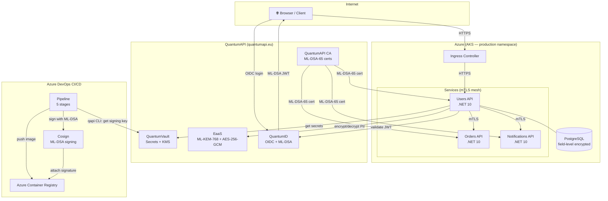

# Quantum-Safe Cloud — Reference Architecture

Full ATLAS document for a production system secured with post-quantum cryptography
using [QuantumAPI](https://quantumapi.eu) (QuantumVault, EaaS, QuantumID).

---

## ATLAS Review

### Architect — Problem & Boundaries

**Problem:** Modern cloud applications store secrets in plaintext environment variables,
sign JWTs with RSA/ECDSA keys, and transmit data encrypted only with classical algorithms.
All of these are vulnerable to "harvest now, decrypt later" attacks: an adversary records
encrypted traffic today and decrypts it once a quantum computer is available.

**Solution boundaries:**
- Secrets: QuantumVault (ML-KEM envelope encryption, QRNG-derived keys)
- Data at rest: field-level encryption via QuantumAPI EaaS (ML-KEM-768 + AES-256-GCM)
- Identity: QuantumID (ML-DSA signed JWTs, OIDC-compliant)
- Transport: mTLS with ML-DSA-65 certificates from QuantumAPI CA
- CI/CD: Cosign container signing with ML-DSA key from QuantumVault

**Out of scope:** end-to-end encryption for user-facing HTTPS (handled by the CDN/load balancer).

---

### Trace — Data Flows

```
┌─────────────────────────────────────────────────────────────────────┐
│  EXTERNAL                                                           │
│                                                                     │
│   Browser ──HTTPS──► Azure Front Door ──HTTPS──► Ingress            │
│                                                                     │
│  IDENTITY PLANE                                                     │
│                                                                     │
│   Browser ──OIDC──► QuantumID ──ML-DSA JWT──► Users API             │
│                                                                     │
│  DATA PLANE (mTLS between all services)                             │
│                                                                     │
│   Users API ──mTLS──► Orders API                                    │
│   Users API ──mTLS──► Notifications API                             │
│   All APIs ──mTLS──► QuantumAPI EaaS (field encryption)             │
│                                                                     │
│  SECRET PLANE                                                       │
│                                                                     │
│   All pods ──TLS──► QuantumVault (secrets, DB passwords, API keys)  │
│   CI/CD pipeline ──qapi CLI──► QuantumVault (signing key)           │
│                                                                     │
│  STORAGE                                                            │
│                                                                     │
│   Users API ──► PostgreSQL (email_ciphertext, phone_ciphertext,     │
│                              searchable_email = SHA3-256 hash)      │
└─────────────────────────────────────────────────────────────────────┘
```

---

### Link — Component Integrations

| Component | Integrates with | Protocol | Auth |
|-----------|----------------|----------|------|
| Users API | QuantumVault | HTTPS | QuantumVault token |
| Users API | QuantumAPI EaaS | HTTPS | API key (from Vault) |
| Users API | QuantumID | OIDC discovery | JWT bearer |
| Users API | Orders API | mTLS | ML-DSA-65 client cert |
| CI/CD pipeline | QuantumVault | HTTPS | Pipeline token |
| CI/CD pipeline | ACR | HTTPS | Azure service connection |
| CI/CD pipeline | AKS | HTTPS | Azure service connection |
| Cosign | QuantumVault | qapi CLI | Pipeline token |

---

### Assemble — Build Order

1. **QuantumAPI account**: create org, get API key, configure QuantumVault namespace
2. **Secrets**: store DB connection strings, service API keys in QuantumVault
3. **Database**: create PostgreSQL schema with ciphertext + hash columns
4. **Users API**: integrate QuantumVault (secret resolution), EaaS (field encryption), QuantumID (auth)
5. **mTLS**: configure Kestrel for client certificate requirements, add NetworkPolicy
6. **CI/CD**: add qapi secret resolution, Cosign signing, SBOM generation
7. **Deploy**: AKS cluster with production namespace, NetworkPolicy applied

---

### Stress-test — Validation Checklist

- [ ] `pnpm build` (or `dotnet build`) succeeds with no warnings
- [ ] All unit tests pass: `dotnet test`
- [ ] QuantumVault: `qapi secret get db/connection-string` returns the correct value
- [ ] EaaS: encrypted field in DB is ciphertext (not plaintext email)
- [ ] EaaS: decrypted value in API response matches original plaintext
- [ ] QuantumID: expired token returns 401; valid token returns 200
- [ ] mTLS: connection without client cert is rejected (SSL handshake error)
- [ ] mTLS: connection with wrong CA cert is rejected
- [ ] Cosign: `cosign verify --key cosign.pub image:tag` succeeds
- [ ] NetworkPolicy: `kubectl exec` from an unauthorized pod cannot reach users-api:443
- [ ] SBOM: `cosign download sbom image:tag` returns CycloneDX JSON

---

## System Diagram (Mermaid)



---

## GOTCHA Prompt — Full System

```
## Goals
Build a production-ready quantum-safe API system using QuantumAPI services.
All secrets must be stored in QuantumVault. All PII must be encrypted at rest
using QuantumAPI EaaS. All tokens must be ML-DSA signed via QuantumID.
All service-to-service calls must use mTLS with QuantumAPI CA certificates.

## Orchestration
1. Bootstrap: resolve all secrets from QuantumVault before starting the application
2. At startup: fetch ML-DSA-65 client certificate from QuantumAPI CA
3. Request pipeline:
   a. Validate QuantumID JWT (ML-DSA signature + issuer + expiry)
   b. Check token introspection endpoint for revocation (fail closed)
   c. Process business logic
   d. Encrypt any PII fields via EaaS before writing to DB
   e. Return decrypted data to caller
4. Background: CertificateRotationService refreshes cert before 80% of lifetime

## Tools
- QuantumAPI SDK (C#): NuGet package QuantumApi.Client
- QuantumVault: https://vault.quantumapi.eu/v1/{org}
- QuantumAPI EaaS: https://api.quantumapi.eu/v1/encrypt + /v1/decrypt
- QuantumID: https://id.quantumapi.eu/.well-known/openid-configuration
- QuantumAPI CA: https://api.quantumapi.eu/v1/pki
- qapi CLI: https://releases.quantumapi.eu/qapi

## Context
- Stack: .NET 10, PostgreSQL, Kubernetes (AKS), Azure DevOps
- All services run in the same AKS namespace (production)
- NetworkPolicy restricts which pods can communicate
- CI/CD signs all container images with Cosign using ML-DSA key from QuantumVault
- Database has two schemas: ciphertext columns + searchable hash columns
- searchable_email = SHA3-256(lowercase(email)) — deterministic, not encrypted

## Heuristics
- Never log plaintext PII
- Never store API keys or connection strings in environment variables or ConfigMaps
- Fail closed: if QuantumVault or QuantumID is unreachable, reject the request
- Encrypt in parallel: use Task.WhenAll for multiple EaaS encrypt calls
- Certificate validation: reject any cert not issued by QuantumAPI CA
- mTLS is required for all inter-service calls — no exceptions

## Args
- QuantumVault namespace: {org-name}
- QuantumAPI EaaS key ID: {key-id} (created via Dashboard or API)
- QuantumID issuer: https://id.quantumapi.eu
- QuantumID audience: {your-api-resource-identifier}
- Certificate TTL: 24h
- Certificate renewal threshold: 80% of lifetime (≈ 19.2h)
- Trivy severity filter: HIGH, CRITICAL
- Cosign: ML-DSA-65, tlog-upload=false (air-gapped environments)
```

---

## Production Checklist

### Before go-live

- [ ] QuantumVault audit log enabled — track all secret reads
- [ ] EaaS key rotation policy defined (e.g., every 90 days)
- [ ] QuantumID token lifetime set to 15 minutes (access) + 24h (refresh)
- [ ] NetworkPolicy applied to all namespaces — test with `kubectl exec`
- [ ] Cosign public key published to `/.well-known/cosign-key.pem` on your domain
- [ ] SBOM stored in artifact registry for each release
- [ ] Trivy scan integrated with Azure Security Center
- [ ] Certificate rotation tested (manually trigger before 80% threshold)
- [ ] Introspection endpoint tested: revoke a token, verify next request gets 401
- [ ] Load test: EaaS latency under p99 target (typically < 50ms per field)

### Ongoing operations

- [ ] Review QuantumVault audit logs weekly
- [ ] Rotate QuantumAPI API keys quarterly
- [ ] Update Trivy database weekly (managed by pipeline runner)
- [ ] Monitor certificate expiry — alert if rotation service fails
- [ ] Subscribe to NIST PQC standard updates (standards may evolve)

---

## Article Series Map

| Article | Code folder | Topic |
|---------|------------|-------|
| 01 | _(concept only)_ | Why your encryption has an expiry date |
| 02 | [quantum-02-quantumvault](../quantum-02-quantumvault/) | Secrets management with QuantumVault |
| 03 | [quantum-03-eaas](../quantum-03-eaas/) | Field-level PII encryption with EaaS |
| 04 | [quantum-04-quantumid](../quantum-04-quantumid/) | ML-DSA identity with QuantumID |
| 05 | [quantum-05-secure-cicd](../quantum-05-secure-cicd/) | Quantum-safe CI/CD pipeline |
| 06 | [quantum-06-zero-trust](../quantum-06-zero-trust/) | Zero trust with mTLS |
| 07 | [quantum-07-reference](../quantum-07-reference/) | This folder — reference architecture |
